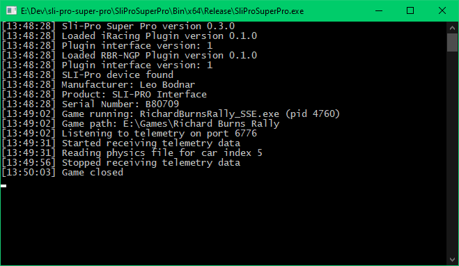

# SliProSuperPro: A Shift Light Indicator Controller
*Copyright 2023, 2024 Fixfactory*

## Overview

SliProSuperPro is a command line application that controls a [Leo Bodnar Electronics SLI-Pro device](https://www.leobodnar.com/shop/index.php?main_page=product_info&products_id=185). SliProSuperPro reads the telemetry data from a sim-racing game and displays the gear, RPM, and speed on the SLI-Pro device.

  

SliProSuperPro currently supports two games:
- [Richard Burns Rally with NGP7](https://rallysimfans.hu/rbr/index.php)
- [iRacing](https://www.iracing.com)

Support for additional games can be added via plugins.

## How To Get It

Windows builds are available via the [releases page](https://github.com/fixfactory/SliProSuperPro/releases).

## How to Use

Simply extract the zip content into a folder and run `SliProSuperPro.exe`. The application will automatically detect when a supported game is running, read the telemetry and display the data on the SLI-Pro device.

Use `SliProSuperPro.exe --help` for a list of options.

  

## iRacing Configuration

The optional `iRacing.Overrides.json` file can be used to specify RPM overrides for some cars. Because the default RPM values reported by the iRacing SDK are wrong for most cars, it is recommended that you test each car and fill in the correct RPM values.

The plugin supports specifying global RPM values that are the same for every gear, or specifying different RPM values for each gear. Use existing overrides as an example. `firstRPM` is the RPM at which the first LED turns On, and `lastRPM` is the RPM at which the last LED turns On causing the shift lights to blink.

## Build Instructions

The preferred method for building is with Microsoft Visual Studio 2022. Open the solution `SliProSuperPro.sln` and build.